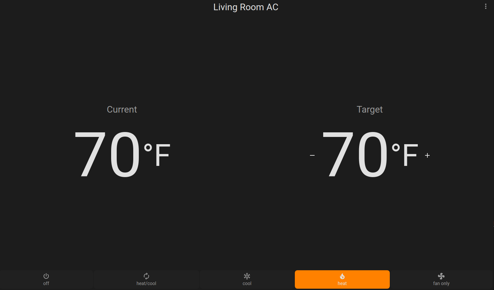
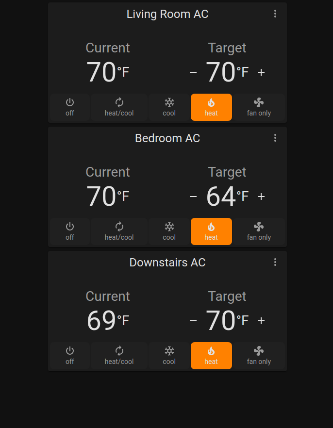

# Obvious Thermostate by [@ShepleySound](https://www.github.com/shepleysound)

A super-simple thermostat for Home Assistant's Lovelace. The goal is to create a thermostat interface that clearly shows both current and target temperatures. This style of display works particularly well in tablet-mounted applications, when the status of a climate device may want to be viewed from a distance.

[![Version][version-shield]][version]
[![License][license-shield]](LICENSE.md)
[![hacs_badge][hacs-shield]](https://github.com/hacs/integration)
[![GitHub Activity][commits-shield]][commits]

  

## Installation
1. In Home Assistant, make sure you have HACS installed.
2. In HACS, go to the "frontend" section
3. Select "Custom Repositories"
4. Add the URL of this repository.
5. Select "Lovelace" under "Category"
6. Click the "Add" Button.
7. The plugin should appear as a new repository. Click the "Download" button.
8. Reload your browser.

[commits-shield]: https://img.shields.io/github/commit-activity/y/shepleysound/obvious-thermostat?style=for-the-badge
[commits]: https://github.com/shepleysound/obvious-thermostat/commits/master
[license-shield]: https://img.shields.io/github/license/shepleysound/obvious-thermostat?style=for-the-badge
[hacs-shield]: https://img.shields.io/badge/HACS-Custom-41BDF5.svg?style=for-the-badge
[version-shield]: https://img.shields.io/github/package-json/v/shepleysound/obvious-thermostat?style=for-the-badge
[version]: https://github.com/custom-cards/obvious-thermostat/releases
